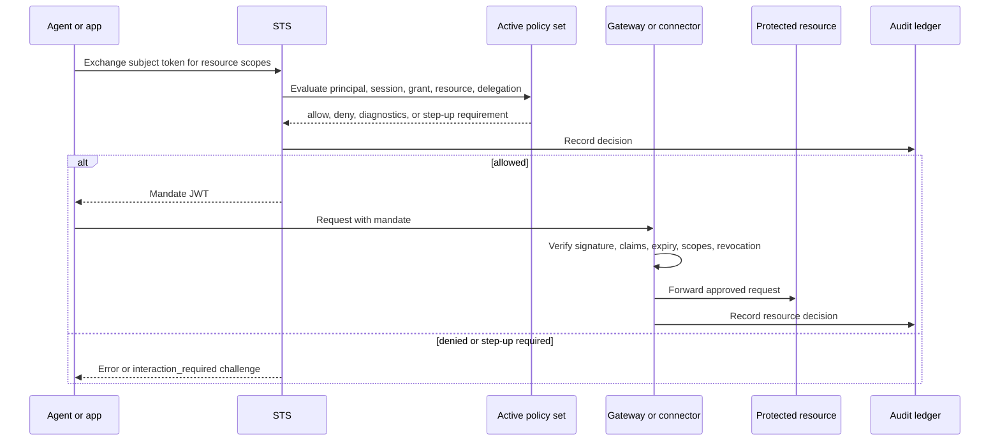

Caracal separates **granting authority** from **using authority**.

- The STS grants authority by issuing a short-lived mandate after policy evaluation.
- The Gateway or connector uses authority by verifying the mandate before forwarding a request or running a tool.

## Enforcement flow

## Layers of control

| Layer | Responsibility | Source of truth |
| --- | --- | --- |
| Zone | Owns keys, policies, resources, sessions, and audit data. | Console or Admin API |
| Grant | Declares which application and user may request resource scopes. | Console or Admin API |
| Policy set | Makes the final allow, deny, or step-up decision. | Rego policy versions |
| Mandate | Carries approved authority as a short-lived signed JWT. | STS |
| Gateway or connector | Verifies mandate claims and revocation before use. | Runtime and resource server config |
| Audit ledger | Records decisions, diagnostics, and request correlation. | API, Console, and storage |

## Default posture

Caracal should be treated as deny-by-default:

1. A resource must be registered.
2. A principal must have an applicable grant or delegation path.
3. The active policy set must allow the requested resource and scopes.
4. The resource server must verify the mandate and revocation anchors.

Missing configuration, invalid signatures, expired mandates, insufficient scopes, revoked sessions, and failed delegation checks all stop the request.

## Gateway and connector roles

Use the Gateway when you want Caracal to front an HTTP upstream and mediate requests centrally. Use a connector when the resource server should verify mandates inside its own framework, such as Express, FastMCP, net/http, or MCP transport.

Both patterns share the same authority model. The difference is only where mandate verification runs.

## What to read next

- [Policy](/concepts/policy/) explains the decision contract.
- [Mandate](/concepts/mandate/) explains the issued token.
- [Sessions and Revocation](/concepts/sessions-revocation/) explains how active authority ends.
