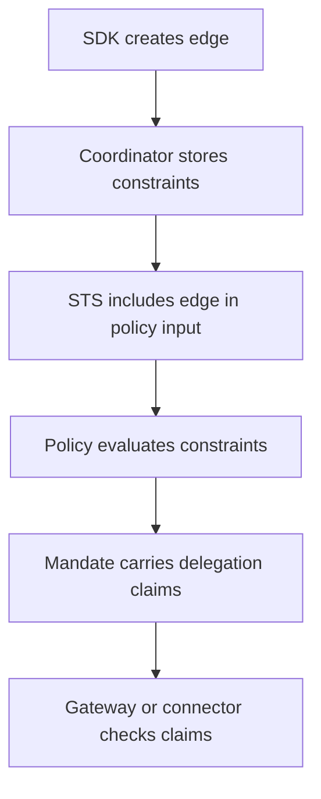

Typed constraints make delegated authority explicit. They are stored on delegation edges and evaluated by policy, SDK context, and resource-server verification.

## Constraint types

| Constraint | Use it to limit |
| --- | --- |
| Resource | Which protected target can be reached. |
| Scopes | Which actions can be requested. |
| TTL | How long the delegated edge remains useful. |
| Hop count | How deep the delegation chain may become. |
| Budget | How much work, calls, or scope count a child can consume. |
| Approval | Whether policy or a reviewer has approved a sensitive edge. |
| Chain membership | Which applications must appear in the delegation path. |

## Example shape

```json
{
  "resource": "https://api.example.com/tickets",
  "scopes": ["tickets:read", "tickets:comment"],
  "max_hops": 2,
  "budget": 5,
  "expires_at": "2026-06-01T12:00:00Z",
  "policy_approved": true
}
```

The exact constraint object can vary by policy design, but it should stay typed, stable, and auditable.

## Where constraints are enforced



## Design guidance

- Put durable business rules in policy.
- Put per-edge runtime limits in constraints.
- Prefer positive allowlists over open-ended deny lists.
- Keep constraints small enough to review in audit traces.
- Use consistent field names across agents so policies stay readable.

## Related pages

- [Delegation Graph](/concepts/delegation/)
- [Policy](/concepts/policy/)
- [Implement Multi-Agent Delegation](/guides/delegation/)
