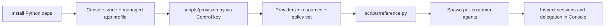

Lynx Capital is a runnable reference under `examples/lynxCapital`. It models a
wealth-management platform: many customer firms each run Portfolio, Research, and Compliance
agents over shared domain services, with every customer isolated by its subject identity and
the policy set. It is the primary reference for modelling customers, the one managed
application, least-privilege agents, resources, and policies on Caracal.

## Architecture

| Building block | Role |
| --- | --- |
| `lynx-platform` | One **managed application** — the durable platform runtime credential that backs every customer's agents. |
| Customers | Each customer is a **subject** (`customer:<id>`), not a separate application; an agent only ever acts for the customer it was spawned for. |
| Agents | Portfolio / Research / Compliance **agent sessions** spawned under the managed application with `metadata={customer_id}`, narrowed to the role's least-privilege scopes. |
| Providers | `pf-mandate`, `rs-mandate`, `cp-mandate` — `caracal_mandate` credential providers the Gateway uses upstream. |
| Resources | `resource://portfolio`, `resource://research`, `resource://compliance`, each with action-oriented scopes. |
| Policy set | `lynx-platform`: `00-base` (default-deny + per-customer subject scoping) plus eleven scenario policies. |

The model is declared once in `config/tenancy.yaml` and `policies/manifest.json`; the SDK
seam, provisioning, and policy all read from it.

### Why customers are subjects, not applications

Caracal multi-tenancy is one zone and one managed application, with each customer modelled as
a **subject**. Per-customer agents are agent sessions spawned under the one managed
application — never separate applications. This keeps a single durable credential while giving
every customer and role its own least-privilege session and audit trail. Dynamic Client
Registration (DCR) is intentionally not used: it is for externally-launched, isolated,
auto-expiring identities bound to a single session, not for an operator fanning out its own
in-process agents.

## Setup flow



## Commands

```bash
cd examples/lynxCapital
python -m venv .venv
source .venv/bin/activate
pip install -e ".[dev]"
cp -n .env.example .env
```

Point the workload `.env` at the Console-generated `caracal.toml` profile (`CARACAL_CONFIG`),
or set the zone, the managed application credential, and `CARACAL_RESOURCES`. Provisioning
uses a separate operator file and a scoped Control key created once in Console.

```bash
cp -n .env.provision.example .env.provision   # set CONTROL_CLIENT_ID / _SECRET
. .env.provision
python scripts/provision.py     # providers, resources, policy set (idempotent)
python scripts/reference.py     # SDK walkthrough: spawn agents, gateway authz, delegation
python scripts/teardown.py      # remove the provisioned objects
```

The managed application is created once in Console (its secret is shown once); provisioning
handles only the providers, resources, and policy set — the policy set is the day-to-day
authorization knob.

## Policies

`policies/` is an importable, OPA-tested library covering portfolio, research, compliance,
customer-admin, auditor, delegated-advisor, and emergency-access scenarios. The base policy
scopes every request to its customer subject and gates premium capabilities on the customer's
`plan` claim. Each policy documents its expected access behavior in `policies/README.md`.

```bash
opa test policies/ -v
```

## SDK integration

Application code uses one seam, `app/caracal.py`, built on `Caracal.connect()`:

```python
from app import caracal

async with caracal.spawn_customer_agent("aurora", "portfolio") as ctx:
    response = await caracal.fetch("portfolio", "/api/read", method="GET")
```

`spawn_customer_agent` correlates the customer in `spawn` metadata, stamps the capability
labels the policy set keys on, and narrows the delegation edge to the role's least-privilege
scopes with a single hop, a short TTL, and a call budget.

## Tests

```bash
opa test policies/ -v
pytest tests/
```

The tests cover the policy decision suite, the provisioning-plan builders, the setup surface,
and the provider transports, topology, and lifecycle of the bundled workload.

## Bundled demo workload

The repository also ships a FastAPI and LangGraph swarm that processes a simulated payout
cycle against local provider fixtures under `_mock/`. It is optional and independent of the
identity model above.

```bash
docker compose -f _mock/docker-compose.yml up -d --build --wait
python -m uvicorn app.main:app --reload --port 8000
docker compose -f _mock/docker-compose.yml down
```

Open `http://localhost:8000`; the guided `/setup` wizard teaches the one-zone,
managed-application, policy-library, and customers-as-subjects flow.

## Related examples

- [Run Echo Upstream](/examples/echo-upstream/)
- [Launch Research Agent](/examples/research-agent/)
