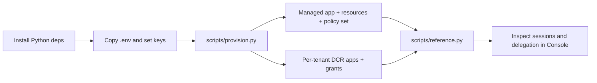

Lynx Capital is a runnable reference under `examples/lynxCapital`. It models a multi-tenant
wealth-management platform: many customer firms (tenants) each run Portfolio, Research, and
Compliance agents over shared domain services, with every tenant isolated by identity,
grants, and policy. It is the primary reference for modelling tenants, applications, agents,
resources, and policies on Caracal.

## Architecture

| Building block | Role |
| --- | --- |
| `lynx-platform` | One **managed application** — the durable platform runtime credential that spawns every tenant's agents. |
| `tenant-<id>` | One **DCR application** per tenant — an isolated, auto-expiring, independently revocable credential boundary. |
| Agents | Portfolio / Research / Compliance **agent sessions** spawned under the managed application, labelled `tenant:<id>` plus role capabilities. |
| Resources | `resource://portfolio`, `resource://research`, `resource://compliance`, each with action-oriented scopes. |
| Policy set | `lynx-multitenant`: `00-base` (default-deny + tenant isolation) plus eleven scenario policies. |

The model is declared once in `config/tenancy.yaml` and `policies/manifest.json`; the SDK
seam, provisioning, and policy all read from it.

### Managed vs DCR applications

Use the **managed application** for the platform's own durable runtime that orchestrates and
spawns agents. Use a **DCR application** to give each tenant an independent, auto-expiring
identity. Per-tenant agents are not separate applications — they are labelled agent sessions
under the one managed application, which keeps a single durable credential while giving each
tenant and role its own least-privilege session and audit trail.

## Setup flow



## Commands

```bash
cd examples/lynxCapital
python -m venv .venv
source .venv/bin/activate
pip install -e ".[dev]"
cp -n .env.example .env
```

Fill in `.env` (deployment environment, service endpoints, the managed platform application,
the control automation key, the admin token, and the three domain resource upstreams), then
provision the platform. Provisioning is idempotent and reads `config/tenancy.yaml` and
`policies/`.

```bash
python scripts/provision.py     # managed app, resources, policy set, per-tenant DCR apps, grants
python scripts/reference.py     # SDK walkthrough: spawn agents, gateway authz, delegation
python scripts/teardown.py      # remove the provisioned objects
```

One-time secrets are written to `config/provisioned.json`; keep it untracked.

## Policies

`policies/` is an importable, OPA-tested library covering portfolio, research, compliance,
customer-admin, auditor, delegated-advisor, and emergency-access scenarios. Each policy
documents its expected access behavior in `policies/README.md`.

```bash
opa test policies/ -v
```

## SDK integration

Application code uses one seam, `app/caracal.py`:

```python
from app import caracal

async with caracal.spawn_agent("aurora", "portfolio") as ctx:
    response = caracal.gateway_call("portfolio", "read", {"account": "..."})
```

`spawn_agent` stamps the `tenant:<id>` and capability labels the policy library keys on and
narrows the delegation edge to the role's least-privilege scopes.

## Tests

```bash
opa test policies/ -v
pytest tests/
```

The tests cover the policy decision suite, the provisioning-plan builders and per-tenant
grants, the multi-tenant setup surface, and the provider transports, topology, and lifecycle
of the bundled workload.

## Bundled demo workload

The repository also ships a FastAPI and LangGraph swarm that processes a simulated payout
cycle against local provider fixtures under `_mock/`. It is optional and independent of the
identity model above.

```bash
docker compose -f _mock/docker-compose.yml up -d --build --wait
python -m uvicorn app.main:app --reload --port 8000
docker compose -f _mock/docker-compose.yml down
```

Open `http://localhost:8000`; the guided `/setup` wizard teaches the managed-application,
policy-library, and per-tenant DCR flow.

## Related examples

- [Run Echo Upstream](/examples/echo-upstream/)
- [Launch Research Agent](/examples/research-agent/)
