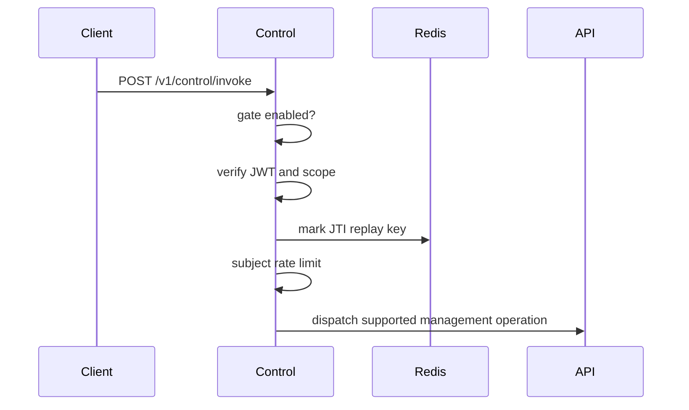

Control is an optional automation surface for remote management operations. It dispatches through the shared engine after gate, authentication, replay, rate-limit, and scope checks.

## Runtime

| Property | Value |
| --- | --- |
| Port | `8087` |
| Health | `GET /health` |
| Readiness | `GET /ready` |
| Invoke | `POST /v1/control/invoke` |
| Compose profile | `control` |
| Helm default | disabled |

## Invoke flow

## Required config

| Variable | Purpose |
| --- | --- |
| `STS_JWKS_URL` | JWT verification keys. |
| `STS_ISSUER_URL` | Expected issuer. |
| `CONTROL_AUDIENCE` | Expected token audience. |
| `CONTROL_REDIS_URL` | Replay protection and rate state in published modes. |
| `CONTROL_API_TOKEN` | API token used for downstream dispatch. |
| `CARACAL_API_URL` | API base URL. |
| `CONTROL_GATE_FILE` | File gate that must exist before invoke is available. |

## Safety behavior

Control returns `503` when the gate is disabled, `401` for authentication or replay failures, `429` for rate limiting, `403` for denied dispatch, `400` for invalid requests, `501` for unsupported commands, and `502` for upstream errors.

Control is a product-management surface. Do not expose it as a top-level `caracal` runtime command.

## Related pages

- [CLI and Console](/runtime-console/cli-and-console/)
- [Trust Boundaries](/architecture/trust-boundaries/)
- [Control API Reference](/api/control-plane/)
